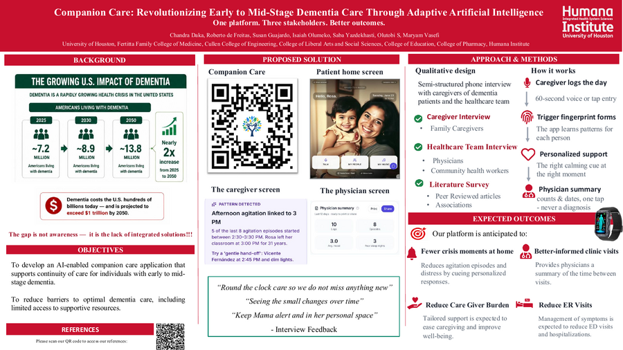

# Companion Care

An adaptive AI companion for people in the early-to-mid stages of Alzheimer's and dementia, and for the caregivers and physicians supporting them. Built during the **SHERP 2026 Summer Research Program** (Humana Integrated Health System, University of Houston) by an interdisciplinary team spanning Engineering, Medicine, Pharmacy, and Public Health.

Companion Care placed **runner-up** in a Shark Tank–style pitch to health-system executives and clinical faculty at the program's closing showcase.

## What it does

Companion Care runs three connected experiences from one app:

- **Patient mode** — daily check-ins and simple logging designed for cognitive accessibility, plus a memory-support companion.
- **Caregiver mode** — visibility into daily logs and behavioral "episodes," with AI-generated summaries instead of raw data to reduce caregiver burden.
- **Physician mode** — a clinical view for reviewing trends and flagged episodes across patients.

Role-based permissions gate what each mode can see and do, and a demo mode lets new users (or judges) explore all three without real patient data.

## Research materials

- **Poster:** [`docs/poster/companion-care-poster.pdf`](docs/poster/companion-care-poster.pdf)
- **Pitch slide:** [`docs/poster/companion-care-slide.pdf`](docs/poster/companion-care-slide.pdf)
- **Abstract:** [`docs/poster/companion-care-abstract.pdf`](docs/poster/companion-care-abstract.pdf)

## Live demo

**[refresh-memory.lovable.app](https://refresh-memory.lovable.app)**

## Tech stack

- [TanStack Start](https://tanstack.com/start) + TypeScript, deployed as an installable PWA
- Supabase (Postgres + Auth) for data and access control
- Google Gemini for AI-generated caregiver summaries and companion conversation

## Program

SHERP 2026 (Summer Healthcare Entrepreneurship Research Program) — Humana Integrated Health System, University of Houston.
